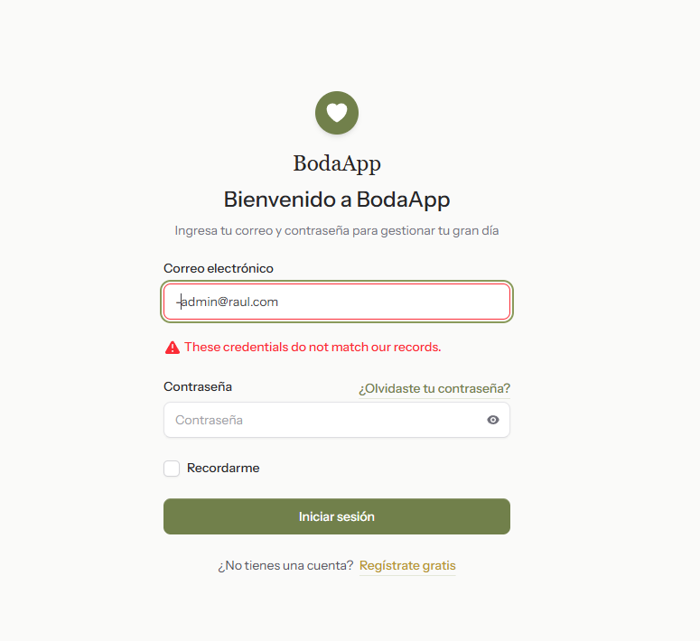
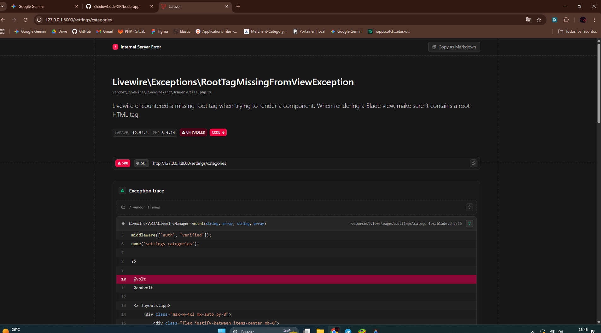
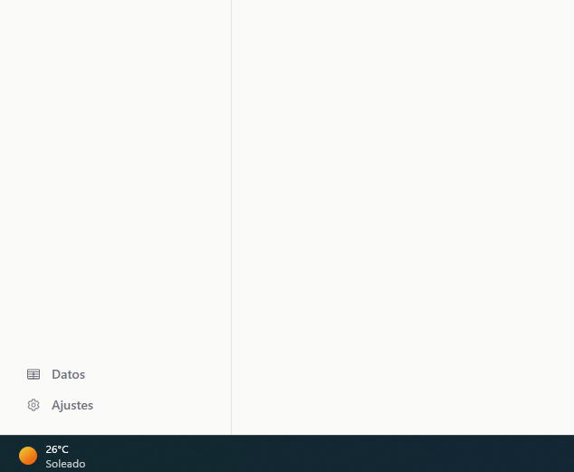
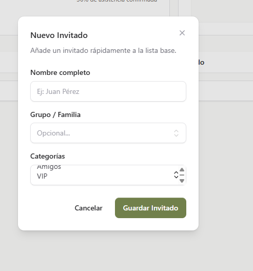
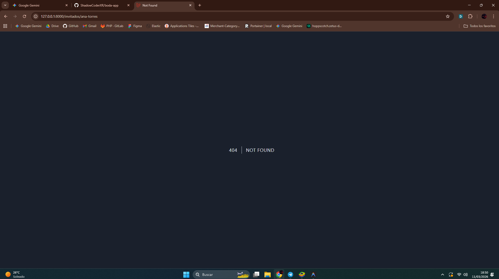
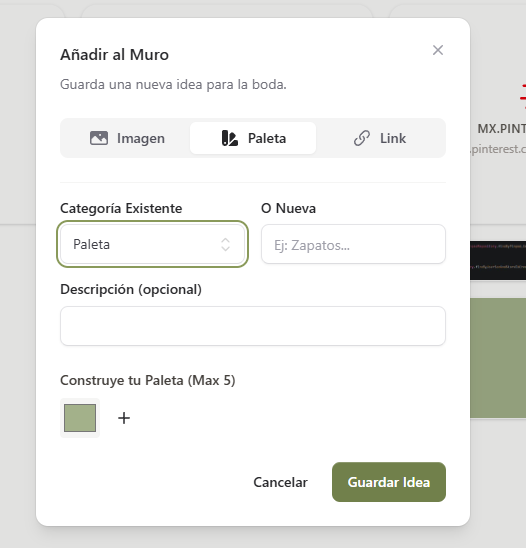
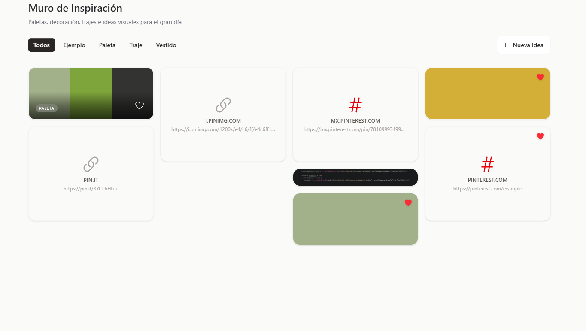
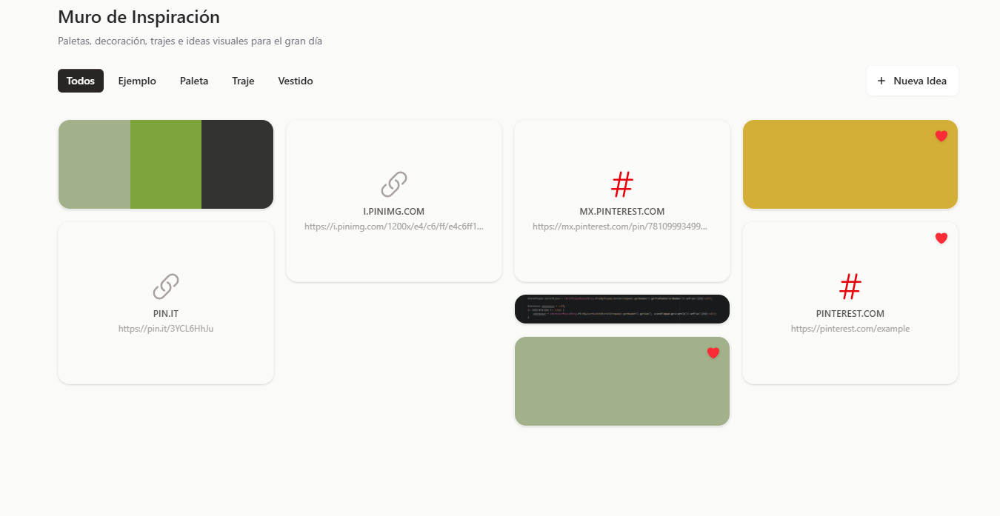
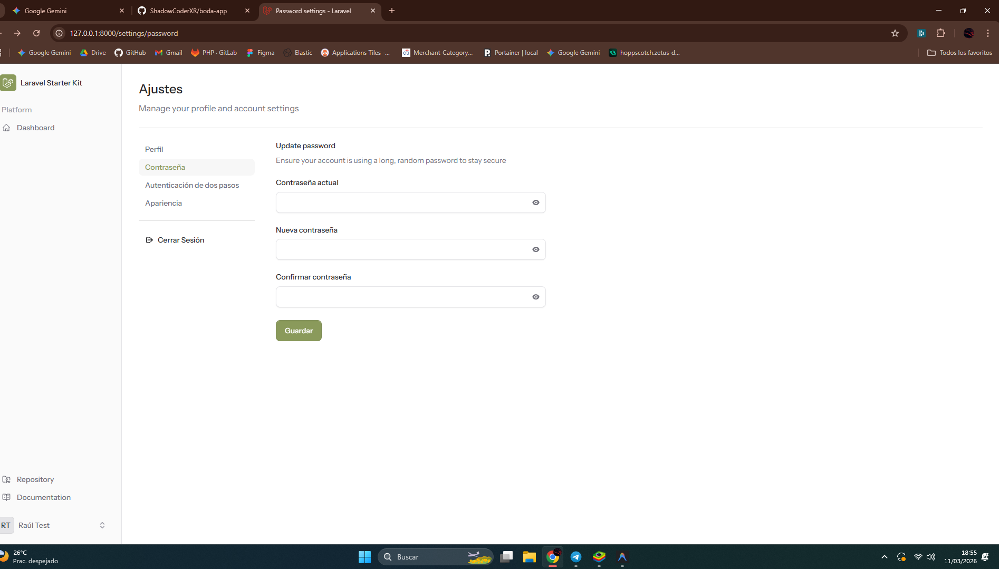

# 👰 Guía de Usuario y Protocolo de QA: BodaApp MVP (Ronda 3)

Bienvenido a la **Ronda 3 de QA** de **BodaApp**. En esta fase nos enfocaremos en validar la robustez de los nuevos módulos de detalle, la traducción al español, y la experiencia móvil optimizada.

---

## 1. Configuración del Entorno (Check Inicial)

- [ ] **Idioma**: Verifica que `.env` tenga `APP_LOCALE=es`.
- [ ] **Assets**: Ejecutar `npm run dev` para ver los nuevos iconos y estilos.
- [ ] **Credenciales**: `admin@boda.com` / `password`.

---

## 2. Módulos Clave para Probar (Nuevos y Mejoras)

### ✅ A. Traducción y Localización (General)

* **Objetivo**: Nada debe estar en inglés.
* **Puntos Críticos**:
  - [ ] Mensajes de error al dejar campos vacíos (Validación).
  - [ ] Pantallas de Login y Registro.
  - [ ] Menús de navegación y botones de acción.

### ✅ B. Gestión de Datos y Detalle de Invitado

* **Nueva Ruta**: `/settings/categories` (Acceso desde "Datos" en el sidebar/ajustes).
  - [ ] Crea una nueva categoría con un color específico.
  - [ ] Crea un grupo y asígnale un "Padre" (Jerarquía).
* **Detalle de Invitado**:
  - [ ] En `/invitados`, haz clic en el nombre de un invitado.
  - [ ] Debería abrirse una página de detalle con el slug correcto (ej: `/invitados/juan-perez`).
  - [ ] Verifica que se vea su Grupo, Categorías y estado RSVP.

### ✅ C. Muro de Inspiración 2.0 (`/inspiracion`)

* **Paletas**:
  - [ ] Crea una "Nueva Idea" de tipo **Paleta**.
  - [ ] Añade 3 o 4 colores diferentes usando el selector.
  - [ ] Verifica que en el muro se vean todos los colores de la paleta.
* **Selector Inteligente**:
  - [ ] Al crear, verifica que puedas elegir una categoría existente del dropdown **O** escribir una nueva.
* **Previsualización de Links**:
  - [ ] Añade un link de YouTube o Pinterest. Verifica que aparezca el icono correspondiente (Play/Hashtag).

### ✅ D. Padrinos y Tareas (`/padrinos`)

* **Asignación**:
  - [ ] Al "Convertir Invitado en Padrino", añade una nota descriptiva desde ese mismo modal inicial.
* **Badge**: Verifica que los estados (Tentativo, Confirmado, Hecho) tengan colores distintos y elegantes.

---

## 3. Protocolo Móvil (Barra de 5 Columnas)

Abre la vista móvil (F12) o desde un dispositivo real:

- [ ] **Navegación**: La barra inferior debe mostrar 5 iconos: **Inicio, Invitados, Padrinos, Inspir. y Ajustes**.
- [ ] **Ajustes**: Entra en "Ajustes" desde el celular.
- [ ] **Cerrar Sesión**: Verifica el botón rojo de "Cerrar Sesión" al final del menú de ajustes móvil.

---

## 4. Reporte de Feedback (Ronda 3)

Borra los comentarios anteriores y usa esta plantilla para tus nuevas observaciones:

```markdown
### 📝 Feedback de QA - Ronda 3
- **Módulo**: [Nombre del Módulo]
- **Dispositivo**: [Desktop / Celular]
- **Observación**: [Describe el error o mejora]
- **Severidad**: [Baja / Media / Crítica]
```

### 📝 Feedback de QA - Ronda 3

- **Módulo**: Login
- **Dispositivo**: Desktop
- **Observación**: Los mensajes de error del login y signup siguen en ingles
- **Severidad**: Media
  

### 📝 Feedback de QA - Ronda 3

- **Módulo**: dashboard
- **Dispositivo**: Desktop
- **Observación**: en el sidebar hay un boton que dice datos que si lo clickeo me sale este error
- **Severidad**: Crítica

  

### 📝 Feedback de QA - Ronda 3

- **Módulo**: Dashboard
- **Dispositivo**: Desktop
- **Observación**: el select de categorias sigue roto
- **Severidad**: Crítica

  

### 📝 Feedback de QA - Ronda 3

- **Módulo**: Invitados
- **Dispositivo**: Desktop
- **Observación**: Si doy click para ir a la pagina de informacion del invitado me da un 404
- **Severidad**: Crítica
- 

### 📝 Feedback de QA - Ronda 3

- **Módulo**: Inspiracion
- **Dispositivo**: Desktop
- **Observación**: lo de seleccionar o crear categoria debe estar en el mismo select parecido a como se puede hacer con select2 en bootstrap
- **Severidad**: Media

  

### 📝 Feedback de QA - Ronda 3

- **Módulo**: Inspiracion
- **Dispositivo**: Desktop
- **Observación**: las paletas y en general todos los post de inspiracion debemos pdoer ver su info y editarlo e incluso eliminarlo, tambien deberiamos agregar una vista donde podamos ver y hacer todo eso como con los invitados
- **Severidad**: Crítica

  

### 📝 Feedback de QA - Ronda 3

- **Módulo**: Inspiracion
- **Dispositivo**: Desktop
- **Observación**: Los links siguen sin darnos una vista previa
- **Severidad**: Crítica
- 

### 📝 Feedback de QA - Ronda 3

- **Módulo**: Configuracion
- **Dispositivo**: Desktop
- **Observación**: seguimos teniendo referencia a laravel starter kit en configuracion cuando no deberia
- **Severidad**: Crítica
- 

---

*Fin de la Guía de Ronda 3*
