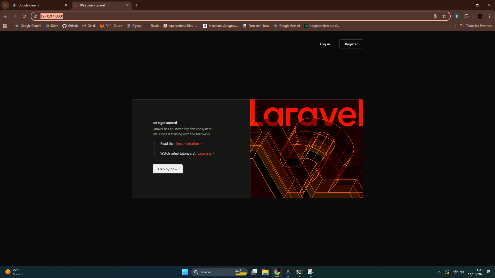
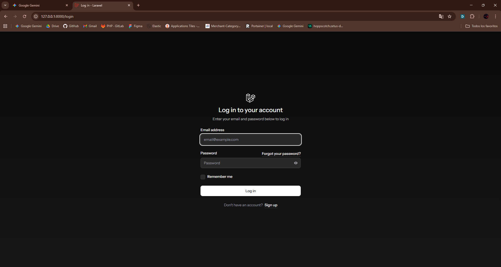
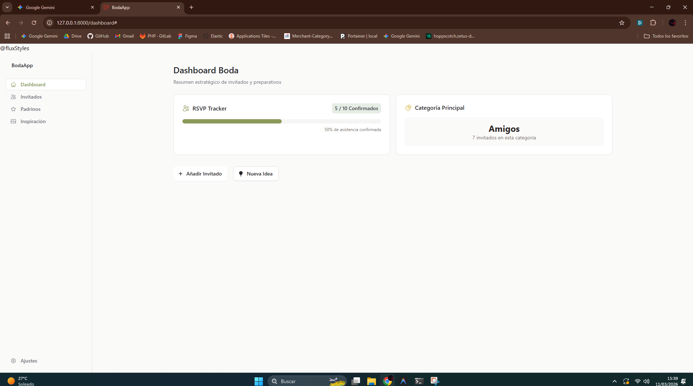
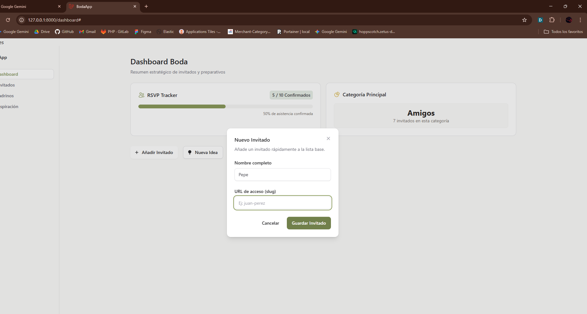
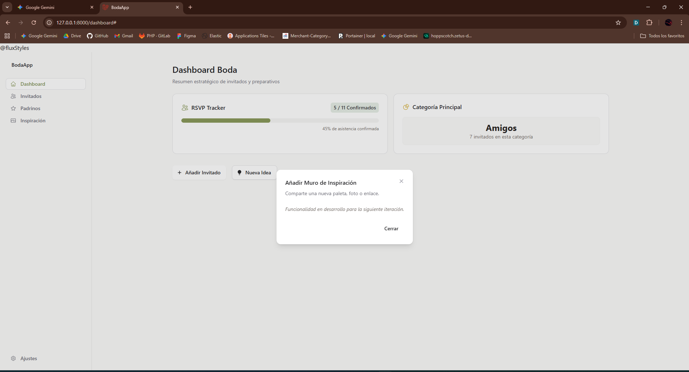
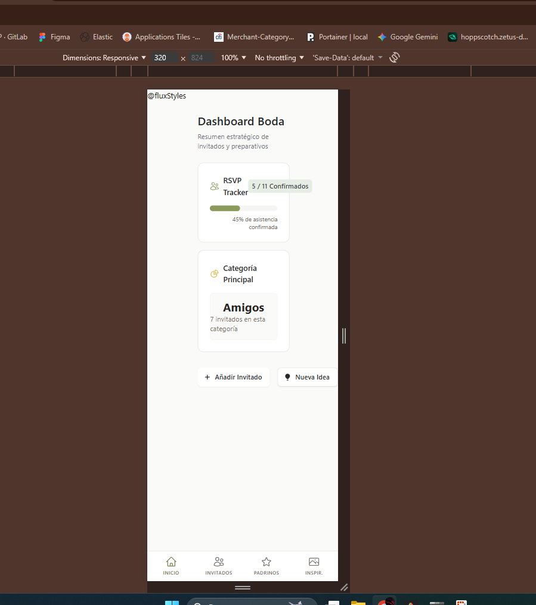

# 👰 Boda-App: Manual de Usuario y Guía de Calidad (QA)

Este documento sirve como guía comprensiva para usar y auditar la versión MVP de la aplicación de gestión de bodas. Cada módulo detalla el comportamiento esperado para que los auditores de QA (o los novios) puedan probar el sistema e identificar áreas de mejora o nuevos requerimientos.

---

## 🛠️ 1. Preparación del Entorno (Para Auditores Técnicos)

Antes de iniciar la auditoría, asegúrate de que el entorno esté preparado con datos de prueba frescos y los enlaces simbólicos de almacenamiento en su lugar.

Ejecuta los siguientes comandos en la raíz del proyecto:

```bash
# 1. Resetear la base de datos y poblar con datos de prueba (Seeder)
php artisan migrate:fresh --seed

# 2. Generar enlace simbólico para la subida de imágenes (Inspiración)
php artisan storage:link

# 3. Compilar los assets de Front-end (Tailwind & Flux UI)
npm run build

# 4. Iniciar el servidor local
php artisan serve
```

**Credenciales de Prueba (creadas por el Seeder):**

- **URL Base:** `http://localhost:8000` o `http://127.0.0.1:8000`
- **Email:** `admin@boda.com`
- **Password:** `password`

---

## 📊 2. Dashboard (`/dashboard`)

El panel de control actúa como resumen central de las estadísticas vitales de la boda.

### 🧪 Qué Probar (QA Checklist)

- [X] **RSVP Tracker:** Verifica que la barra de progreso muestre correctamente el número de confirmados versus el total de invitados. (Ej: 6/10).
- [ ] **Top Categoría:** Confirma que el sistema indique la categoría con mayor número de invitados asignados.
- [X] **Acciones Rápidas (Botones):**
  - Haz clic en **"Añadir Invitado"**. Debe abrir un Modal centrado. Cancela la acción pulsando la "X" o el botón cancelar para probar la usabilidad.
  - Haz clic en **"Nueva Idea"**. Debe abrir un Modal correspondiente.
- [ ] **Responsividad (Mobile):** Inspecciona la página en modo móvil. La barra de navegación izquierda debe transformarse en una cómoda *Bottom Tab Bar* pegada al fondo de la pantalla.

---

## 👥 3. Gestión de Invitados (`/invitados`)

Módulo para buscar, filtrar y modificar las conformidades (RSVP) de todos los asistentes.

### 🧪 Qué Probar (QA Checklist)

- [ ] **Jerarquía de Grupos:** Asegúrate de que los invitados aparezcan agrupados y categorizados en *Cards* separadas. Revisa que se renderice correctamente en texto la ruta de familias y sub-grupos (Ej: `Familia Silva > Amigos`).
- [ ] **Filtro Reactivo:** Usa el desplegable de **"Categoría"** superior. Al seleccionar una opción (ej: *Amigos*), la página debe filtrar a los asistentes *instantáneamente* sin recargar la pestaña del navegador.
- [ ] **Visualización del Estado:** Verifica que cada invitado cuente con un *Badge* visual (Pending, Confirmed, Declined) que utilice un color distintivo.
- [ ] **Edición de RSVP:**
  1. Haz clic en el ícono de **lápiz (✏️)** en cualquier invitado.
  2. Modifica el estado del dropdown a *Confirmado*.
  3. Ingresa datos dinámicos en los campos de Menú o Alergias (Ej: "Menú Vegano", "Alergia al Maní").
  4. Guarda los cambios. El *Modal* debe cerrarse y la lista actualizarse visualmente.
  5. Refresca la ventana con `F5` para corroborar que el JSON SQLite almacenó la data exitosamente.

---

## 🎨 4. Muro de Inspiración (`/inspiracion`)

Este módulo funciona como un tablero visual colaborativo (Al estilo Pinterest) para centralizar ideas de vestidos, decoración, colores y locaciones.

### 🧪 Qué Probar (QA Checklist)

- [ ] **Renderizado "Masonry":** Inspecciona el Grid de tarjetas. A diferencia de un cuadro rígido estándar, las columnas deben intercalarse orgánicamente (Pinterest-style) asumiendo distintos altos.
- [ ] **Filtros (Categorías de Ideas):** Juega con los botones de chip en la cabecera (Ej: "Todos", "Decoración", "Vestidos"). Se deben filtrar instantáneamente.
- [ ] **Sistema de Favoritos (Liking):**
  - Haz clic en el ícono de corazón (♡) de alguna tarjeta en "hover".
  - El ícono debe colorearse rojo (♥).
  - Navega a otra página y regresa (o refresca con F5) para verificar que tu registro de DB `is_favorite` fue persistido.
- [ ] **Modal de Nueva Idea Inteligente:**
  1. Haz clic en **"Nueva Idea"**.
  2. Al marcar el *Radio Button* en **Color**, el formulario debe cambiar y mostrarte un *Color Picker Selector HTML*. Escoge un rojo o verde, y guárdalo. Debería mostrar un hexágono con ese código HEX en la galería exterior.
  3. Al marcar **Imagen**, debe aparecer un input clásico de *File Upload*. Sube un `.jpg` o `.png`. Asegúrate de que el spinner de "Procesando Imágen..." se visualice un breve segundo.
  4. Verifica que la imagen subida se pinte correctamente en el Muro (prueba que `artisan storage:link` esté bien referenciado).

---

## 💍 5. Gestión de Padrinos (`/padrinos`)

Módulo que coordina qué invitados tienen responsabilidades críticas (Anillos, Ramos, Oficiantes, etc).

### 🧪 Qué Probar (QA Checklist)

- [ ] **Estados Vacíos:** Si no habías creado un padrino antes, la UI debe mostrar en el centro de pantalla una ilustración estática elegante diciendo *"Aún no hay padrinos asignados"*.
- [ ] **Asignación (Filtrado Inteligente):**
  1. Presiona **"Convertir Invitado en Padrino"**.
  2. Despliega la lista de nombres. Este select **no debe** contener asistentes biológicamente repetidos, ni personas que ya hayas escogido como padrino previamente en otra tanda.
  3. Crea un rol (ej: *"Anillos"*).
  4. Después de guardar, la pantalla debe arrojar una *Card* estilizada con el invitado, el Rol, y un *Badge* amarillo diciendo *"Tentativo"*.
- [ ] **Flujo de Trabajo del Rol (Edición JSON):**
  1. Presiona el ícono de lápiz en el nuevo Padrino creado.
  2. Cambia la opción de "Tentativo" a "Confirmado".
  3. Añade una nota interna para la pareja en el textbox (Ej: *"Traerá la caja blanca"*).
  4. Guarda los cambios. Verifica que en el UI el badge cambió a Verde ("Confirmado") y que la cita se muestra estilizada cursivamente en las *Cards*.

---

## 📝 Anexo: Reporte de Comentarios (Feedback Template)

*Si eres un usuario beta probando la plataforma, por favor usa esta tabla y re-entrégasela al Agente/Manager para ejecutar las mejoras de la Versión 2.*

| Módulo Evaluado       | Funcionalidad               | Éxito (Si/No) | Comentarios, Fallos (Bugs) o Mejoras Sugeridas |
| :--------------------- | :-------------------------- | :------------- | :--------------------------------------------- |
| **Global**       | Responsividad Móvil        | NO             | se descuadra                                   |
| **Dashboard**    | RSVP y Estadísticas        | No             | tiene algunas areas de mejora                  |
| **Invitados**    | Filtros, Grupos y Edición  |                |                                                |
| **Invitados**    | Almacenado JSON de Alergias |                |                                                |
| **Inspiración** | Subida de Imágenes Reales  |                |                                                |
| **Inspiración** | Corazones Reactivos         |                |                                                |
| **Padrinos**     | Lista sin duplicados Guest  |                |                                                |
| **Padrinos**     | Edición de Notas y Estatus |                |                                                |

> **Nota para el Usuario:** Copia la tabla, rellena tus comentarios y dime en el chat prompt: *"He probado el sistema. Aquí está mi feedback basado en la guía: [pegar feedback]"*. Iteraremos juntos hasta que sea perfecto.

## Notas extra:

- La url raiz no lleva al login. evidencia:
- la ruta login aun tiene los logotipos de laravel y esta en ingles lo mismo con el signup. evidencia:
- El side bar no sirve 
- el slug deberia ser automatico no definirlo nosotros 
- esta la parte de nueva idea pero dice que esta en desarrollo cuando realmente ya se desarrollo
- cuando agrego un invitado en ningun lado me da la opcion de seleccionar grupo o categoria en el dashboard
- en mobil se ve descuadrado

  
-
